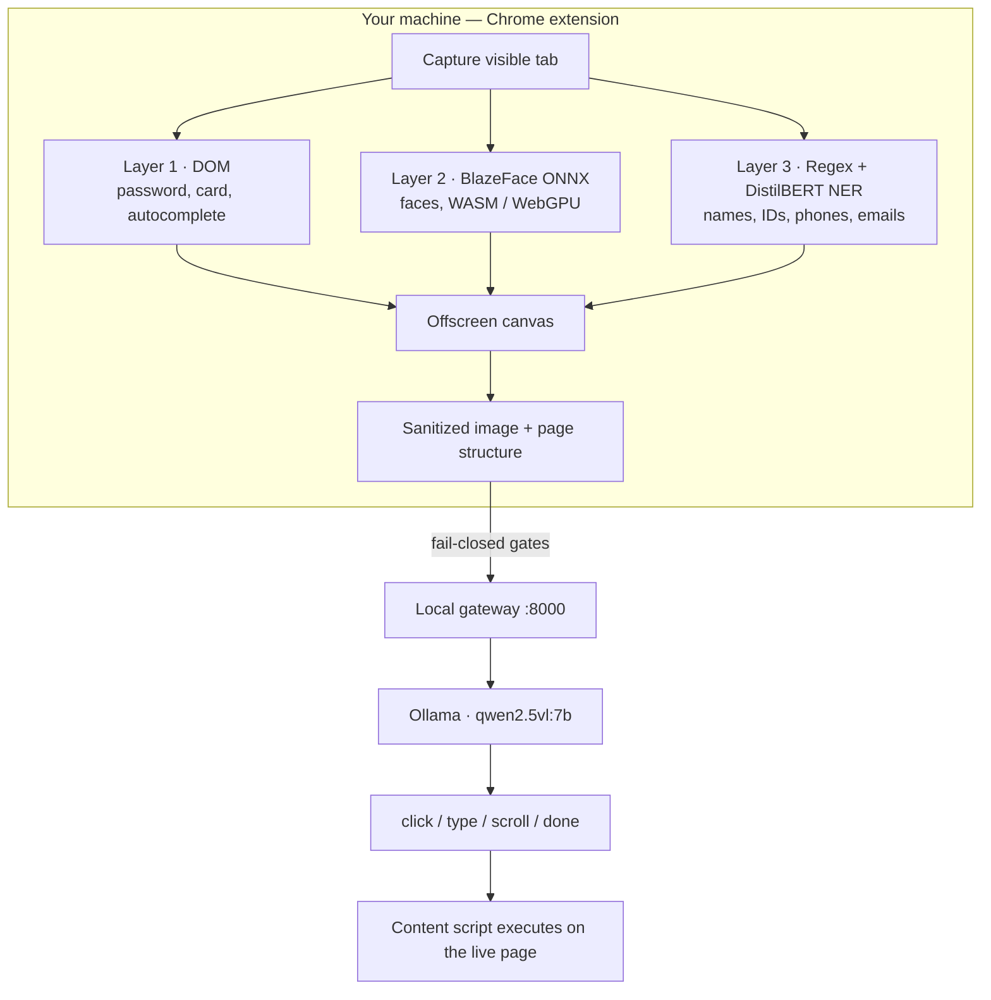

# Aegis

**On-device visual perception for lightweight browser agents**

Smart India Hackathon 2026 · [SIH26171](docs/00_INDEX.md) · Indian Space Research Organisation · Software

> Before a screen ever leaves your laptop, Aegis looks at it locally — blurs faces, blacks out passwords, masks personal data — and only then lets an AI agent act on what remains.

Today’s browser agents understand a page by sending a raw screenshot to the cloud. That is convenient. It is also a screenshot of your PAN, your salary, the face in the sidebar, and the password you just typed. Aegis is the missing trust layer: a Chrome extension that **sanitizes the viewport on-device**, then optionally asks a vision model what to do next.

Privacy scan needs no server. Form-fill and the agent loop use a local gateway on your machine. Raw pixels and never-store identifiers do not go to the cloud.

---

## Why it exists

Ask an AI agent to fill a loan form and it will do it well — by photographing the entire screen and shipping that photo to a server you will never see. You wanted help. You did not consent to a copy of your identity documents leaving the room.

That is not a hypothetical. Leading agents work this way because running real vision *inside the browser*, fast enough to be useful, is hard. Aegis is built for that gap.

**The agent still gets enough structure to act. It never gets what it did not need to see.**

---

## What it does

| You click | What happens on the device | What may leave the device |
|---|---|---|
| **Privacy scan** | Capture → detect → redact. Overlay boxes. Sanitized preview + privacy receipt. | Nothing. No model call. |
| **Fill Form** | Match saved profile and vault text to visible labels. | Leftover empty fields only, via the **local** vision model, on a sanitized frame. |
| **Run Agent** | Same redaction pipeline, then a multi-step action loop. | Sanitized image + page structure + task. Fail-closed if face or NER redaction did not finish. |
| **Upload a PDF / DOCX / TXT** | Extract text in the extension. Strip Aadhaar, PAN, and other never-store IDs. | Optional: extracted text to `localhost` after per-upload consent. Raw bytes never leave. |

Everyday browsing may outline password and PII fields. It does **not** run face detection on other people. Faces are scanned only on Privacy Scan, Run Agent, or an explicit **Scan faces now** action.

---

## How it works

Three detection layers run **before** any network request. A fourth step is optional.



| Layer | Method | Mask |
|---|---|---|
| Sensitive fields | Live DOM (`type="password"`, `autocomplete`, labels) | Solid black fill |
| Faces | BlazeFace ONNX (~400 KB) in a Web Worker | Gaussian blur |
| Structured PII | Deterministic regex (Aadhaar, PAN, SSN, phone, email, cards) | Blur |
| Unstructured PII | DistilBERT NER via Transformers.js (names, places, orgs) | Blur |

WASM is the always-on baseline so a judge’s machine does not need WebGPU. The Node gateway on port **8000** sits in front of Ollama because Chrome’s `chrome-extension://` origin is rejected by Ollama on `:11434` with HTTP 403.

The invariant: **the raw screenshot and PII strings never leave the extension.** The model sees a redacted frame and a structural sketch (“a password field exists here”), not the password.

Deeper maps: [Architecture](docs/02_ARCHITECTURE.md) · [Profile & Fill Form](docs/PROFILE_FILL_ARCHITECTURE.md) · [Document trust boundary](docs/PRIVACY_DOC_UPLOAD.md)

---

## Quick start

You need **Chrome 109+** (Manifest V3) and this repository. A vision model is optional for the first demo.

### 1. Build the load root

Do not load the repo root in `chrome://extensions`. Chrome would bill `node_modules/` and `.git/` to the extension (historically **1.4 GB**). The judged artifact is `dist/` (~**81 MB** with vendored NER).

```bash
bash scripts/build-dist.sh
```

### 2. Load the extension

1. Open `chrome://extensions`
2. Enable **Developer mode**
3. **Load unpacked** → select the `dist/` folder (the one that contains `manifest.json`)
4. On the Aegis card, turn on **Allow access to file URLs** (required for local eval pages)

### 3. Privacy scan — no server

This is the hero path. It proves redaction without Ollama.

1. Open [`eval/test-pages/tp08-kitchen-sink-registration.html`](eval/test-pages/tp08-kitchen-sink-registration.html)
2. Click the Aegis icon and wait for **BlazeFace ready (WASM)** (first open can take up to a minute)
3. Click **Privacy scan**

You should see overlays on password and card fields, a **sanitized preview** with a blurred face and blacked-out secrets, and a receipt with `faces > 0` and `piiSpans > 0`.

The first scan after a cold load can take **30–90 seconds** (WASM compile + NER init). Later scans are faster.

If you reload the extension, **refresh the tab** before scanning again. Otherwise the content script is gone and you will see `[NO_CONTENT_SCRIPT]`.

### 4. Optional — Fill Form and Run Agent

For the agent loop you need Node 18+, [Ollama](https://ollama.com), and the local gateway.

```bash
ollama pull qwen2.5vl:7b          # ~4.7 GB, once
ollama serve

cd server && node index.js        # gateway on :8000 — not mock mode
curl -sS http://localhost:8000/health
# expect: "mock": false   "upstreamReachable": true
```

In the popup, keep the defaults:

| Setting | Value |
|---|---|
| VLM endpoint | `http://localhost:8000/v1/chat/completions` |
| Model | `qwen2.5vl:7b` |
| API key | empty |

Paste [`eval/fixtures/dummy-profile-ananya.json`](eval/fixtures/dummy-profile-ananya.json) into **My Profile Data**, save, then **Fill Form** or **Run Agent**. Trap fields on TP08 (Aadhaar, PAN, Blood Group, Emergency Contact) should stay empty.

Full click-path, recovery codes, and what to say to judges: **[Demo runbook](docs/DEMO_RUNBOOK.md)**. Operator deploy notes: **[Backend deploy](docs/BACKEND_DEPLOY.md)**.

---

## Repository

```
SIH26/
├── manifest.json          # Chrome MV3 — load the copy inside dist/, not this tree
├── src/
│   ├── background/        # Orchestrator, VLM client, vault, fail-closed gates
│   ├── content/           # DOM scan, overlays, action execution
│   ├── offscreen/         # Canvas masks, document extract (pdf.js)
│   ├── inference/         # ONNX / Transformers.js worker
│   ├── popup/             # Control panel
│   ├── shared/            # Profile, PII strip, file helpers
│   └── vendor/            # ORT, BlazeFace, DistilBERT, pdf.js
├── server/                # OpenAI-compatible gateway → Ollama
├── scripts/build-dist.sh  # Assembles the unpacked load root
├── eval/
│   ├── test-pages/        # Ground-truth pages (TP01–TP08)
│   ├── fixtures/          # Demo profile
│   └── harness/           # Node regression suite
└── docs/                  # Requirements, architecture, privacy, demo
```

---

## Evaluation

SIH26171 scores five things. Aegis is designed against all five.

| Criterion | Weight | How we measure it |
|---|---|---|
| Visual accuracy | 25% | Structural payload vs. annotated test pages |
| PII detection | 20% | Precision / recall on faces, passwords, text PII |
| Redaction precision | 20% | Mask IoU — not under-redacting, not wiping the UI |
| Client resources | 20% | `dist/` size, peak memory, WASM path |
| End-to-end latency | 15% | Capture → redact → (optional) VLM → act |

Regression suite (no `npm test` script — run the files directly):

```bash
for f in eval/harness/*.test.js; do node "$f"; done
```

Harness files live in `eval/harness/`. Chrome E2E on `eval/test-pages/` is a separate gate. See [eval/README.md](eval/README.md) and [docs/04_EVAL_TEST_PLAN.md](docs/04_EVAL_TEST_PLAN.md).

---

## Documentation

| Document | What it is |
|---|---|
| [docs/00_INDEX.md](docs/00_INDEX.md) | Map of every planning and operator doc |
| [docs/01_REQUIREMENTS.md](docs/01_REQUIREMENTS.md) | Functional / non-functional requirements, redaction taxonomy |
| [docs/02_ARCHITECTURE.md](docs/02_ARCHITECTURE.md) | Components, sanitization pipeline, VLM contract |
| [docs/03_TECH_STACK_MODELS.md](docs/03_TECH_STACK_MODELS.md) | Model choices and ADRs |
| [docs/DEMO_RUNBOOK.md](docs/DEMO_RUNBOOK.md) | Judge path on TP08, errors, recovery |
| [docs/PRIVACY_DOC_UPLOAD.md](docs/PRIVACY_DOC_UPLOAD.md) | What may leave the device for document upload |
| [docs/PROFILE_FILL_ARCHITECTURE.md](docs/PROFILE_FILL_ARCHITECTURE.md) | Profile, vault, face policy, Fill Form |
| [docs/SERVER_SETUP.md](docs/SERVER_SETUP.md) | Measured Ollama install and smoke tests |
| [CHANGELOG.md](CHANGELOG.md) | What changed in 0.1.0 |

---

## Stack

| Layer | Choice |
|---|---|
| Extension | Chrome Manifest V3 — service worker, offscreen document, content scripts |
| Face detection | BlazeFace ONNX via ONNX Runtime Web |
| Text PII | Hybrid regex + `Xenova/distilbert-base-uncased-finetuned-conll03-english` |
| Documents | Vendored pdf.js / DOCX unzip — no network to parse a file |
| Agent model | Qwen2.5-VL 7B through Ollama (`qwen2.5vl:7b`) |
| Gateway | Node, OpenAI-compatible `POST /v1/chat/completions` on `:8000` |

Version **0.1.0**. Built for Smart India Hackathon 2026, problem statement SIH26171.

---

## A note on honesty

Aegis reduces document and screen exposure to **this device**, a **local model you start**, and a **consent-gated** loopback call. It does not claim that a file “never exists outside the browser” once you opt into local AI structuring — that text transits `localhost:8000` on purpose.

What it *does* claim, and enforce in code: raw screenshots are not sent; never-store IDs are stripped before vault write and before any model; remote endpoints cannot receive uploaded document text; if face or NER redaction fails, the VLM call does not happen.
