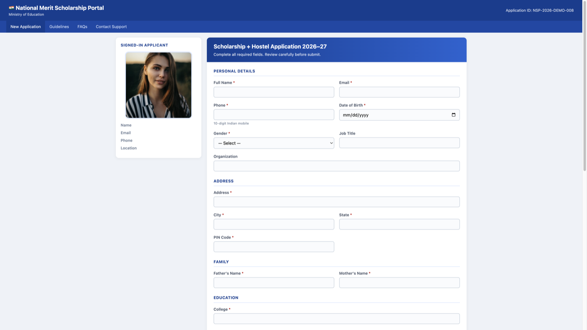
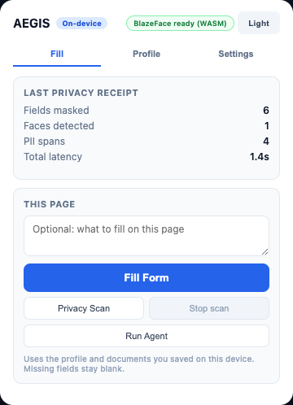
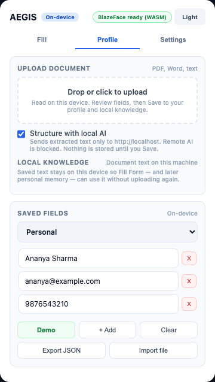
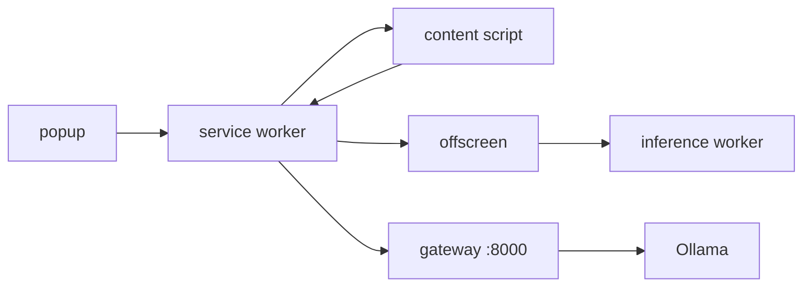

<p align="center">
  
</p>

<p align="center">
  <a href="#the-bit-that-matters">story</a>
  ·
  <a href="#what-you-are-looking-at">the product</a>
  ·
  <a href="#the-machine">how it works</a>
  ·
  <a href="#tonight">run it</a>
  ·
  <a href="#where-the-code-lives">the repo</a>
</p>

<p align="center">
  <sub>Smart India Hackathon 2026 · SIH26171 · ISRO · Chrome extension, v0.1.0</sub>
</p>

---

If you just joined: this file is the tour. Not the spec. Specs live in [`docs/`](docs/00_INDEX.md). Read this first, click around, then pick a folder.

**Sharing with teammates for the hackathon:** send [`docs/TEAMMATE_REFERENCE.md`](docs/TEAMMATE_REFERENCE.md) — one short file that covers the whole system.

AEGIS is a Chrome extension that looks at the page **on your laptop**, covers up the private bits, and only then — if you ask it to — lets a vision model help fill the form. The name is from Greek: a shield, a **protector or defender**. Privacy Scan never calls a server. Fill Form and Run Agent talk to a process you start on `localhost`. Raw screenshots do not leave the browser.

---

## The bit that matters

You ask a browser agent to fill a scholarship form. It does. It also just photographed the whole tab — the applicant’s face in the sidebar, the password field, the Aadhaar box — and sent that picture to a machine you will never see.

That is how most of these agents work. They need the pixels to understand the page. We got tired of that trade.

So we put a small vision stack *inside* Chrome. Faces get blurred. Passwords get painted black. Names and ID numbers get masked. What the model receives is a cleaned picture plus a sketch of the layout: “there is a password field here.” Not the password.

Same form. Same help. Different contract.

<p align="center">
  
</p>

<p align="center">
  <sub>TP08. Fake portal, real traps. Aadhaar / PAN / blood group are supposed to stay empty. Face lives in the sidebar on purpose.</sub>
</p>

<details>
<summary><strong>New here? Pick a door.</strong></summary>

<br/>

**I want to see it in five minutes.**  
Build `dist/`, load it in Chrome, open TP08, hit Privacy Scan. No Ollama. [Jump](#tonight)

**I need to know how the pieces connect.**  
Capture → three detectors → canvas masks → optional local model. [Jump](#the-machine)

**I am going to change code.**  
Service worker orchestrates. Content script touches the page. Offscreen document runs models. [Jump](#where-the-code-lives)

**I care about what we promised judges.**  
Five scored criteria. Fail-closed gates. Honest privacy wording. [Jump](#what-we-are-scored-on)

</details>

---

## What you are looking at

The toolbar icon opens a 360px panel. Three tabs. That is the whole product surface.

<p align="center">
  
  &nbsp;&nbsp;
  
</p>

| Tab | What it is for |
|---|---|
| **Fill** | The three verbs: Privacy Scan, Fill Form, Run Agent. After a scan you get a receipt (fields / faces / PII / time) and a sanitized preview. |
| **Profile** | Your data, on this device. Drop a PDF. Save fields. Switch Personal / Work / Family. Ananya’s demo JSON lives in [`eval/fixtures/dummy-profile-ananya.json`](eval/fixtures/dummy-profile-ananya.json). |
| **Settings** | Face / password / PII toggles, plus the local model URL. Default endpoint is `http://localhost:8000/v1/chat/completions`. Leave the API key empty. |

Everyday browsing may outline password and PII fields. It does **not** run face detection on strangers in the tab. Faces only happen on Privacy Scan, Run Agent, or **Scan faces now**.

| You click | On the device | Off the device |
|---|---|---|
| Privacy Scan | Capture, detect, redact, overlay, receipt | Nothing |
| Fill Form | Match profile + vault text to labels | Leftover empty fields, local model, sanitized frame |
| Run Agent | Same redaction, then a loop of actions | Sanitized image + page structure + the task |
| Drop a PDF | Extract text here. Strip Aadhaar, PAN, and friends | Only if you tick local AI — and only to `localhost` |

The toolbar, the popup, and this file all say **AEGIS**. That is the product name.

---

## The machine

<p align="center">
  
</p>

Chrome is a weird place to run models, so the work is split on purpose.

```
page  ──DOM scan / clicks──►  content script
                                    │
toolbar / task  ──────────────────►  service worker
                                    │
                          screenshot + text
                                    ▼
                             offscreen document
                          (hidden page with a canvas)
                                    │
                                    ├── Web Worker: BlazeFace + DistilBERT
                                    └── canvas: blur faces, black passwords
                                    │
                          sanitized PNG + layout sketch
                                    │
                         ┌──────────┴──────────┐
                         │                     │
                    stop here              localhost:8000
                 (Privacy Scan)          (Fill leftovers /
                                           Run Agent)
                                               │
                                          Ollama :11434
                                          qwen2.5vl:7b
```

The extension never talks to Ollama directly. Chrome sends `Origin: chrome-extension://…` and Ollama answers **403**. The Node gateway on **:8000** is the fix: CORS, action JSON cleanup, a guard that rejects tiny images before they crash the model runner.

WASM is the path that has to work on a judge’s laptop. WebGPU is a bonus if `navigator.gpu` shows up. Demo cannot depend on it.

<details>
<summary><strong>The three detectors, in English</strong></summary>

<br/>

**1. The DOM (no model).**  
Walk the live page. `type="password"`, `autocomplete="cc-number"`, labels that say PIN, Aadhaar, PAN. Cheap, deterministic, should never miss a password field. Those rectangles get a solid black fill.

**2. Faces.**  
[BlazeFace](https://github.com/tensorflow/tfjs-models/tree/master/blazeface) as a ~400 KB ONNX file, run with ONNX Runtime Web in a worker. Bounding boxes become a Gaussian blur. Off unless you asked.

**3. Text PII.**  
Regex first (Aadhaar, PAN, SSN, phone, email, cards) because those patterns should not be a neural-net problem. Then DistilBERT NER via Transformers.js for names, places, organisations in the visible text. Those spans get blurred.

All three have to finish before a vision-model call. If face redaction was required and it did not run, the request does not go. Same for NER. That is what “fail-closed” means in this repo.

</details>

<details>
<summary><strong>Fill Form is two steps, not one magic button</strong></summary>

<br/>

1. **On the device.** Map saved profile keys and vault text onto visible labels. No model. Trap fields on TP08 (Aadhaar, PAN, blood group, emergency contact, project blurb, portal PIN) should stay blank because they are not in Ananya’s fixture.
2. **Leftovers only.** One local-model pass on a sanitized screenshot. Vault document text is allowed in that prompt only when the endpoint is loopback.

If you never start Ollama, step 1 still works. Step 2 will complain politely.

</details>

<details>
<summary><strong>What we will not claim</strong></summary>

<br/>

Uploading a PDF and ticking “structure with local AI” *does* send extracted text to a process on your machine. We do not say “the file never exists outside the browser.” We say: bytes stay here, never-store IDs are stripped first, remote models are refused, vault text is capped (5 docs / 256 KB).

Typed profile values in an agent prompt are a known, older risk if someone points the endpoint at a hosted model. Document text is not allowed to follow that path.

Full writeup: [`docs/PRIVACY_DOC_UPLOAD.md`](docs/PRIVACY_DOC_UPLOAD.md).

</details>

---

## Tonight

You need Chrome 109+. A vision model is optional for the first run.

### 1. Build the thing Chrome should load

```bash
bash scripts/build-dist.sh
```

`dist/` is the unpacked root. About **81 MB** with the NER tree inside. Load **that** folder.

If you point Chrome at the repo root it will count `node_modules`, `.git`, demo profiles… last time we measured **1.4 GB**. Do not do that.

### 2. Load unpacked

1. `chrome://extensions`
2. Developer mode
3. Load unpacked → `dist/`
4. On the card, **Allow access to file URLs** (or TP08 as `file://` will not see the content script)

### 3. Privacy Scan, no server

Open [`eval/test-pages/tp08-kitchen-sink-registration.html`](eval/test-pages/tp08-kitchen-sink-registration.html). Click the icon. Wait until the badge says **BlazeFace ready (WASM)** — first time can take a while; it is compiling 13 MB of WASM, not hung. Then **Privacy Scan**.

You want: orange boxes on secrets, a preview with a blurred face and black password fields, receipt counts that are not zero.

Reload the extension? Refresh the tab. Otherwise `[NO_CONTENT_SCRIPT]`.

### 4. If you want Fill / Run Agent

```bash
ollama pull qwen2.5vl:7b     # ~4.7 GB, once
ollama serve

cd server && node index.js   # real gateway, not --mock
curl -sS http://localhost:8000/health
# mock: false, upstreamReachable: true
```

Popup defaults are already `:8000` and `qwen2.5vl:7b`. Paste Ananya’s JSON, save, Fill Form.

Judge click-path, error codes, what to say out loud: [`docs/DEMO_RUNBOOK.md`](docs/DEMO_RUNBOOK.md).

<details>
<summary><strong>Afternoons we already donated so you do not have to</strong></summary>

<br/>

| Symptom | What it actually is |
|---|---|
| Extension size is hundreds of MB | You loaded the repo, not `dist/` |
| `[NO_CONTENT_SCRIPT]` on a `file://` page | File URL access off, or you reloaded the extension and forgot to refresh the tab |
| HTTP 403 talking to Ollama | You aimed Chrome at `:11434`. Aim at `:8000` |
| First scan sits for a minute | WASM + NER cold start. Wait. Next one is faster |
| `[FACE_REDACTION_REQUIRED]` | Face gate blocked the VLM. Check the sidebar photo actually rendered |
| `[NER_REDACTION_REQUIRED]` | NER did not load. Rebuild `dist/` so `src/vendor/models/` is in it |
| Ollama 500, “model runner stopped” | Degenerate image or memory pressure. Restart Ollama, pre-warm. Gateway now rejects images under 28 px so this happens less |
| `npm run start:mock` in a demo | `/health` will say `"mock": true`. Judges should not see that |

</details>

---

## Where the code lives

```
src/background/     the manager. capture, gates, VLM client, vault
src/content/        lives in the tab. DOM scan, overlays, types into fields
src/offscreen/      hidden page. canvas masks + PDF/DOCX extract
src/inference/      Web Worker. BlazeFace + DistilBERT
src/popup/          the panel you just looked at
src/shared/         profile parse, never-store strip, file helpers
src/vendor/         ORT, models, pdf.js — do not “clean this up”
server/             Node gateway :8000 → Ollama
scripts/build-dist.sh
eval/test-pages/    TP01–TP08, including the scholarship form
eval/harness/       node tests. run them
docs/               longer than this file, on purpose
```

`manifest.json` at the repo root is the source. The copy Chrome runs is the one inside `dist/`. After you touch `src/`, rebuild.

<details>
<summary><strong>Who is allowed to talk to whom</strong></summary>

<br/>



Content script cannot see the models. The worker cannot click the page. The gateway never receives a raw screenshot. If you add a “just send the image” shortcut you are breaking the project, not shipping a feature.

</details>

---

## What we are scored on

SIH26171 is not “did the form fill.” It is five weighted checks.

| | Weight | In this repo |
|---|---|---|
| Does the local stack understand the screen | 25% | Structural payload vs annotated pages |
| PII recall / precision | 20% | Faces, passwords, text |
| Redaction precision | 20% | Mask the secret, not the submit button |
| Client resources | 20% | `dist/` size, memory, WASM path |
| End-to-end latency | 15% | Capture → redact → maybe VLM → act |

There is no `npm test`. Run the files:

```bash
for f in eval/harness/*.test.js; do node "$f"; done
```

Chrome walking TP08 is a separate thing ([`eval/harness/tp08-chrome-e2e.mjs`](eval/harness/tp08-chrome-e2e.mjs)). The Node harness passing is not a substitute for clicking the popup yourself.

---

## The rest of the shelf

| When you need | Open |
|---|---|
| The map of every doc | [`docs/00_INDEX.md`](docs/00_INDEX.md) |
| Requirements + redaction taxonomy | [`docs/01_REQUIREMENTS.md`](docs/01_REQUIREMENTS.md) |
| Full architecture | [`docs/02_ARCHITECTURE.md`](docs/02_ARCHITECTURE.md) |
| Why these models | [`docs/03_TECH_STACK_MODELS.md`](docs/03_TECH_STACK_MODELS.md) |
| Profile, vault, face policy | [`docs/PROFILE_FILL_ARCHITECTURE.md`](docs/PROFILE_FILL_ARCHITECTURE.md) |
| Document trust boundary | [`docs/PRIVACY_DOC_UPLOAD.md`](docs/PRIVACY_DOC_UPLOAD.md) |
| Spoken pitch | [`docs/INDUSTRY_PITCH_SCRIPT.md`](docs/INDUSTRY_PITCH_SCRIPT.md) |
| Judge runbook | [`docs/DEMO_RUNBOOK.md`](docs/DEMO_RUNBOOK.md) |
| Gateway / 403 story | [`docs/BACKEND_DEPLOY.md`](docs/BACKEND_DEPLOY.md) |
| Measured Ollama numbers | [`docs/SERVER_SETUP.md`](docs/SERVER_SETUP.md) |
| What changed in 0.1.0 | [`CHANGELOG.md`](CHANGELOG.md) |

Plain-language library tour, if the words ONNX and WASM still feel made-up: [`docs/06_TECH_EXPLAINER.md`](docs/06_TECH_EXPLAINER.md).

---

Every agent on the market asks you to trust it with the whole screen. We did not want that to be the price of having one. That is the difference this repo is for.
