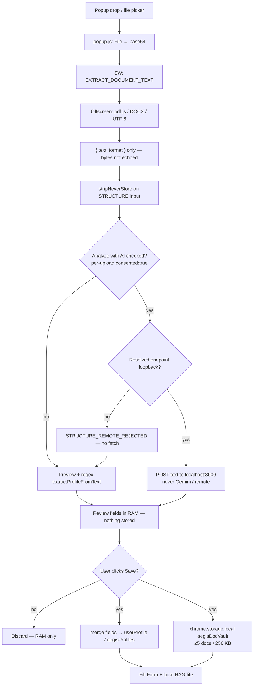
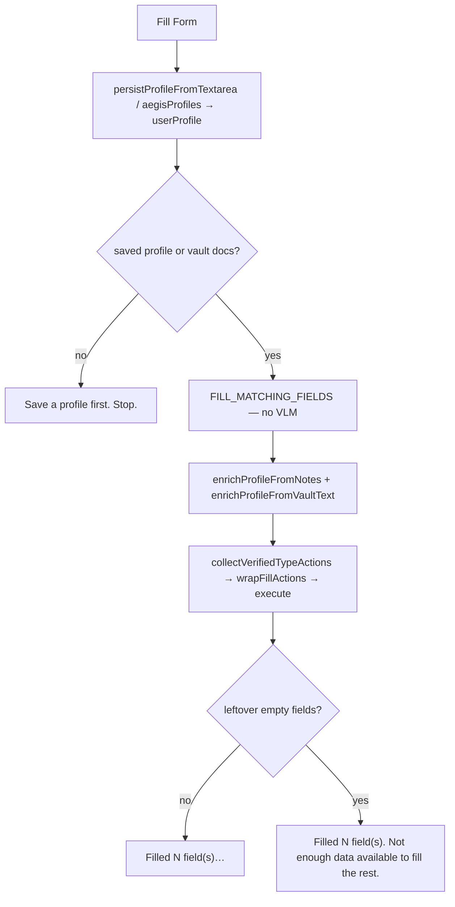

# Profile, document vault, and Fill Form — where work runs

**SIH26171 (AEGIS).** This is the code-accurate map of three product flows. Trust-boundary rules for document upload live in [PRIVACY_DOC_UPLOAD.md](PRIVACY_DOC_UPLOAD.md). Do not treat this as a roadmap: every box is a real function or storage key.

Companion: [02_ARCHITECTURE.md](02_ARCHITECTURE.md) (sanitization + VLM agent). Storage shapes: [STORAGE_CONTRACT.md](STORAGE_CONTRACT.md). Vault cap in code is **5 docs / 256 KB** (`src/background/doc-vault.js`).

---

## 1. Who runs what

| Work | Content script | Service worker | Offscreen | Local gateway `:8000` | Remote VLM |
|---|---|---|---|---|---|
| Idle browse overlays | DOM password/PII only (`includeFaces: false`) | — | — | — | **never** |
| Privacy Scan / Run Agent (faces **on**) | `DOM_SCAN`, face overlays | `SCAN_AND_OVERLAY` / `CAPTURE_AND_SANITIZE` | BlazeFace + NER + mask | Agent leftovers / Run Agent if endpoint is loopback | Sanitized image + page structure + **profile** only. **No vault document text.** |
| Privacy Scan / Run Agent (faces **off**) | Field overlays only | Same handlers; `faceDetection: false` | NER + password masks; **no** BlazeFace | Same as above | Same as above; face gate skipped |
| “Scan faces now” | Same as faces-on scan | `SCAN_AND_OVERLAY` with `forceFaces: true` | BlazeFace + NER | — (scan has no VLM) | **never** |
| PDF/DOCX/TXT extract | — | `EXTRACT_DOCUMENT_TEXT` (relay) | pdf.js / zip+XML / UTF-8 → `{ text }` | **never** (bytes never leave the device) | **never** |
| Optional AI structure | — | `STRUCTURE_DOCUMENT_TEXT` (consent + loopback guard) | — | Extracted **text** only, after per-upload consent | **refused** (`isLocalVlmEndpoint`) |
| Vault write | — | `ADD_DOC_TO_VAULT` → `aegisDocVault` | — | — | **never** |
| Fill Form, step 1 | `DOM_SCAN` (`fillableFields`) | `FILL_MATCHING_FIELDS` — no VLM | — | — | **never** |
| Fill Form, step 2 (leftovers) | Execute `type` / `fill_many` | `CAPTURE_AND_SANITIZE` | Sanitize capture | `DOCUMENT KNOWLEDGE` snippets **only if loopback** | Profile + sanitized image; vault cache cleared |

Raw PDF/DOCX bytes never go to the gateway or a remote model. Never-store IDs (Aadhaar/PAN/licence/UPI/passport/bank) are stripped **before** local VLM structure and **before** vault write.

---

## 2. Document ingest — PDF → local text → optional local AI → Save confirm → device save



**Client vs server (honest):**

- **On device:** parse, preview, regex profile fields, vault text, never-store strip.
- **Local process the user runs:** optional structure via `http://localhost:<port>` (Chrome uses gateway `:8000`, not Ollama `:11434` directly).
- **Not claimed:** “the document never exists outside the browser.” With consent it transits loopback to the local model. Remote Gemini **cannot** receive document text.

---

## 3. Face-scan policy — idle off / toggle / on-demand

```
Idle MutationObserver (every page)
  → scanDOMForSensitiveFields + passwordDetection filter
  → SHOW overlays with includeFaces: false
  → no BlazeFace, no photo-alt “Secured” boxes

Fill-tab toggle  ──sync──  Settings checkbox  →  chrome.storage.local faceDetection
        │
        ├─ OFF → Privacy Scan / Run Agent: includeFaces false, SANITIZE faceDetection false
        └─ ON  → Privacy Scan / Run Agent: BlazeFace + face overlays (fail-closed before VLM)

“Scan faces now” / Settings “Scan faces on this page”
  → forceFaces: true for that SCAN_AND_OVERLAY (on-demand, one pipeline)
```

Everyday pages with many human faces do **not** all get “Secured”. That badge is for explicit scan / agent / “scan faces now”, and only while the face toggle is on (or force-scan).

---

## 4. Fill Form — client match only



**Client only:** maps labels to values already on device (structured profile, notes, regex fields from vault text). Matching fields are written even when others stay empty. Invented names never enter this path. Leftovers are a status warning, not a VLM call. Run Agent is the path that talks to the local model.

---

## 5. Storage keys (device)

| Key | What | Leaves device? |
|---|---|---|
| `userProfile` / `aegisProfiles` | Field map (never-store IDs omitted) | Values may appear in a VLM **system prompt** (profile). Vault text does not ride along on remote. |
| `aegisDocVault` | Pre-stripped document **text** | Local VLM snippets only; never remote; never raw PDF. |
| `faceDetection` | Boolean, default on | No |
| `docConsent` | Optional stored consent; popup also sends per-upload `consented` | No |

Vault and profile are plaintext in `chrome.storage.local` (honest UI: stored unencrypted on this device).
